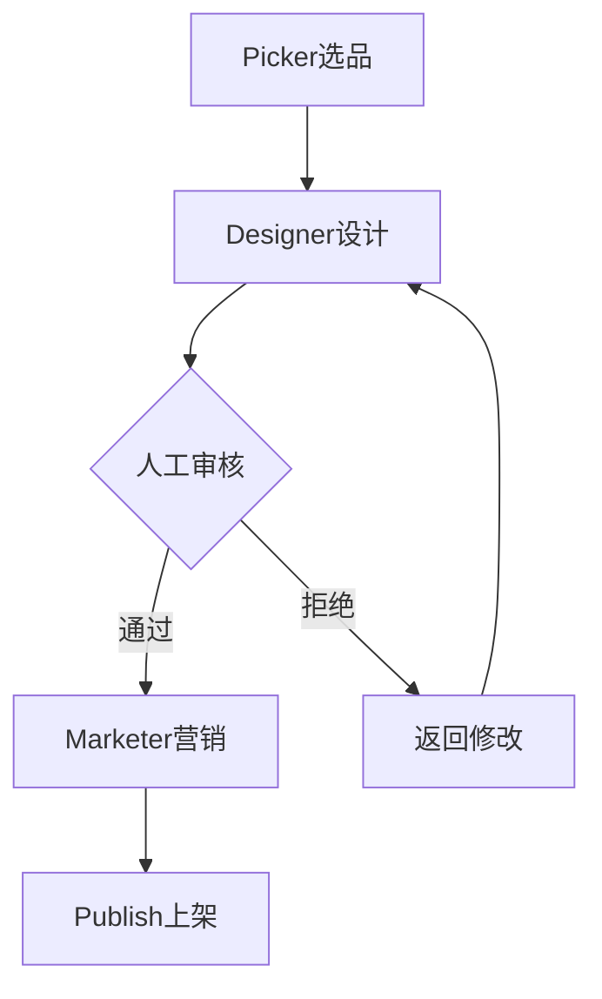

# LangGraph.ts 迁移指南

## 为什么要用 LangGraph？

### 当前方案的局限
```typescript
// 当前：简单的顺序执行
orchestrator.runDailyPick() // Picker -> Designer -> Marketer
// ❌ 不支持条件分支
// ❌ 不支持循环迭代
// ❌ 不支持人机交互暂停
// ❌ 状态管理分散
```

### LangGraph 的优势
```typescript
// LangGraph：可视化工作流
workflow
  .addNode('picker', pickerNode)
  .addNode('designer', designerNode)
  .addConditionalEdges('review', routeAfterReview) // ✅ 条件分支
  .addEdge('marketer', 'publish')
// ✅ 支持中断/恢复（人工审核）
// ✅ 状态集中管理
// ✅ 可视化追踪
```

## 核心概念对比

| 概念 | 当前实现 | LangGraph |
|------|---------|-----------|
| **Agent** | Class 实例 | Graph Node |
| **状态** | 分散在 DB | 集中 State |
| **流程控制** | 代码逻辑 | Graph Edge |
| **人机交互** | ❌ | ✅ Interrupt |
| **可视化** | ❌ | ✅ LangSmith |

## 迁移步骤

### Step 1: 安装依赖
```bash
npm install @langchain/langgraph @langchain/core @langchain/openai
```

### Step 2: 替换 Orchestrator
```typescript
// 之前
import { AgentOrchestrator } from './orchestrator'
const orchestrator = new AgentOrchestrator()
orchestrator.runDailyPick()

// 之后
import { createProductWorkflow } from './workflow'
const workflow = createProductWorkflow()
const result = await workflow.invoke({
  trendSource: 'TikTok',
  theme: 'Halloween'
})
```

### Step 3: 添加人工审核（关键）
```typescript
// workflow.ts 中 reviewNode 改为:
async function reviewNode(state: State, config?: RunnableConfig) {
  // 保存到审核队列
  await db.reviewQueue.create({
    productIdea: state.productIdea,
    designResult: state.designResult,
    status: 'pending'
  })
  
  // 中断工作流，等待人工审核
  const interruptValue = {
    type: 'human_review',
    message: '请审核产品设计',
    data: {
      title: state.productIdea?.title,
      imageUrl: state.designResult?.imageUrl
    }
  }
  
  // LangGraph 会在这里暂停
  return Command INTERRUPT(interruptValue)
}

// 管理员审核后，通过API恢复工作流:
// POST /api/workflow/resume
// body: { threadId: 'xxx', decision: 'approve' }
```

## 关键改进点

### 1. 人机交互审核（重要）


### 2. 错误处理与重试
```typescript
// LangGraph 自动支持重试
workflow.addNode('picker', pickerNode, {
  retryPolicy: {
    maxAttempts: 3,
    delay: 1000,
  }
})
```

### 3. 状态持久化
```typescript
// 可以恢复中断的工作流
const checkpoint = await app.getState(threadId)
await app.updateState(threadId, newState)
```

## API 路由更新

```typescript
// src/app/api/workflow/route.ts
import { createProductWorkflow } from '@/lib/ai/workflow'

export async function POST(request: Request) {
  const body = await request.json()
  
  const workflow = createProductWorkflow()
  
  // 启动工作流
  const result = await workflow.invoke({
    trendSource: body.trendSource,
    theme: body.theme,
  }, {
    configurable: {
      thread_id: body.threadId || crypto.randomUUID(),
    }
  })
  
  return NextResponse.json(result)
}

// 恢复中断的工作流
export async function PATCH(request: Request) {
  const { threadId, decision, feedback } = await request.json()
  
  const workflow = createProductWorkflow()
  
  // 恢复工作流
  const result = await workflow.invoke({
    reviewApproved: decision === 'approve',
    reviewFeedback: feedback,
  }, {
    configurable: { thread_id: threadId }
  })
  
  return NextResponse.json(result)
}
```

## 决策建议

### 使用当前方案，如果：
- ✅ 快速验证 MVP
- ✅ 工作流简单（线性流程）
- ✅ 团队不熟悉 LangChain 生态

### 迁移到 LangGraph，如果：
- ✅ 需要人工审核节点
- ✅ 工作流复杂（条件分支、循环）
- ✅ 需要可视化监控
- ✅ 长期维护考虑

## 混合方案（推荐）

可以渐进式迁移：
```typescript
// 保留现有 Agent 逻辑
class PickerAgent extends BaseAgent {
  // 现有代码不变
}

// 用 LangGraph 编排
const workflow = new StateGraph()
  .addNode('picker', async (state) => {
    const agent = new PickerAgent(config)
    return agent.execute(state)
  })
  .addNode('review', humanReviewNode) // LangGraph 特性
```

## 下一步

1. **试用 LangGraph**：先用 `workflow.ts` 测试
2. **评估复杂度**：如果工作流确实需要分支/暂停，全面迁移
3. **LangSmith 集成**：可视化追踪，优化 Prompt
